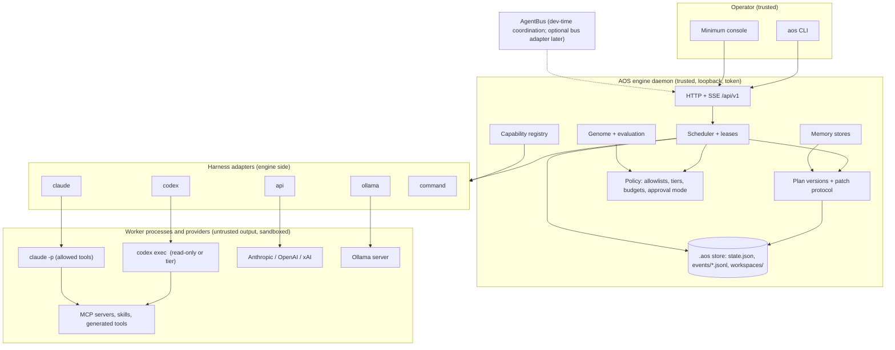
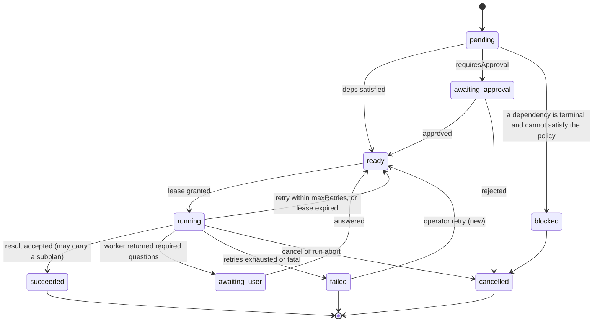
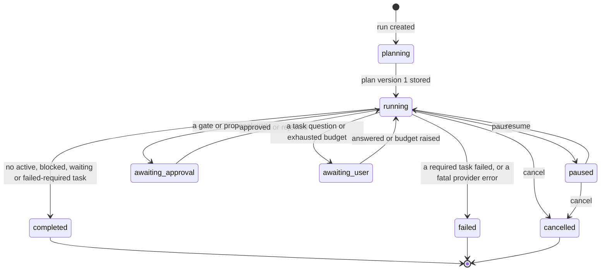
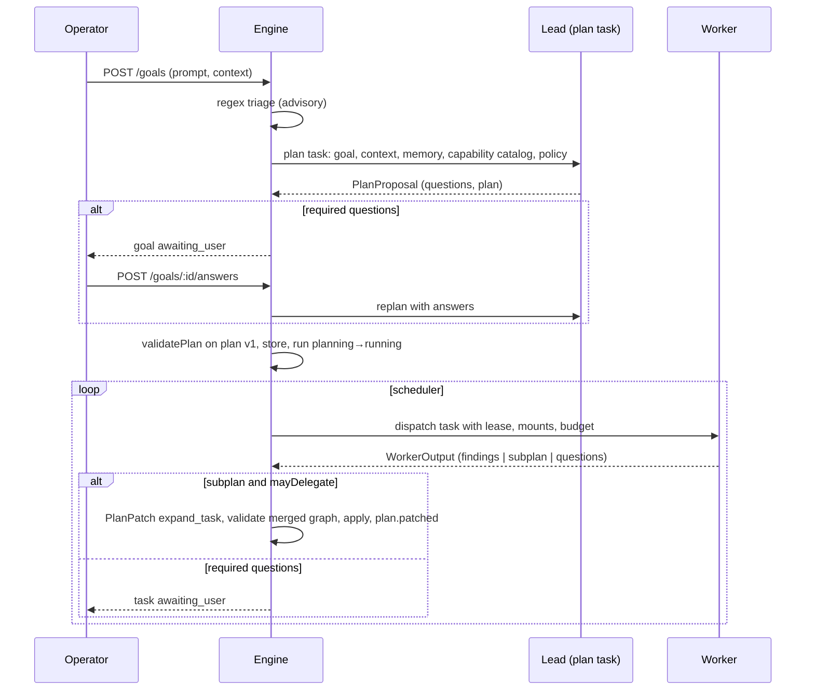

# AOS architecture dossier

Version 0.1 · 2026-09-14 · Author: Claude Fable 5.1 (AOS planner and coordinator, bus id `fable-aos`) · Requested by the founder through Codex task `01a09583-62f7-7c71-aee2-d856167b1444` (bus message `msg_rftdttvni1`).

This turn was read-only. No application file was modified. The only new file is this dossier.

## 1. Summary

AOS already has the hard part of an orchestration kernel: a tested dependency scheduler, isolated per-task workspaces, an append-only event log, and one live worker adapter whose model and effort are verified from the harness's own session record. What it lacks is everything that makes it *agentic*: nothing in the repo writes a plan, changes a plan while a run is going, chooses a model or tool per task, remembers across runs, or turns a retrospective into a measured, reversible change.

The architecture below keeps the kernel and adds six things around it, in this order:

1. **Plans become versioned data with a patch protocol.** A lead planner is a worker role that emits a plan; any task with delegation rights emits sub-plans; the engine validates and applies patches under a lock. This is what gives you hierarchy of any depth.
2. **A harness adapter contract** with three attestation levels (verified from a session record, self-reported by the API, none), per-task model, effort and sandbox tier chosen by the planner within project policy, and conformance tests before any adapter is enabled.
3. **A capability registry** on disk for skills, MCP servers, plugins and generated tools, with a mandatory test before the planner may assign one.
4. **Typed improvement proposals** applied into a versioned genome, evaluated against a baseline benchmark, approved by someone other than the proposer, and always reversible.
5. **Three memory stores** as inspectable files, with retrieval injected into briefs and writes governed by scope policy.
6. **A minimum operator console** fed by a server-sent event stream: goal, hierarchy, harness and model per worker, tokens and cost, evidence, gates, generation deltas.

The smallest end-to-end vertical slice is Stage 1 in section 10: goal, clarification, plan from a deterministic planner stub, one mid-run expansion, one worker question answered by the operator, evidence, retrospective, typed proposal, approval, and a new genome version, all on the local deterministic worker under test, then repeated live on Codex.

Before that slice, nine kernel defects found in this audit must be fixed (section 9), because a lead planner and multiple adapters will hit every one of them. Most serious: no cross-process locking is actually used, orphan requeue double-dispatches across processes, and the HTTP API mutates state with no authentication and a wildcard CORS header.

Five decisions are the founder's and are listed in section 11: git and custody, the default improvement policy, which harness comes second, the AgentBus's role at runtime, and the four proposals still pending on the benchmark run.

## 2. Scope and limits

Inspected: the whole `engine/`, `bin/`, `tests/`, `src/lib`, `src/app`, `src/pages/LivePages.jsx`, `bench/`, `scripts/luna-bench.mjs`, `docs/`, `PRODUCT.md`, `DESIGN.md`, the benchmark evidence under `evidence/luna-max-e2e/bench-live-20260913T083130Z/`, the pre-edit backup tarball (for the diff of what changed on 2026-09-13), the design context under `public/techno-renaissance/` (IDEA.md, DESIGN.md, the design prompt and reference index), and the AgentBus supervisor source at `/Users/anon5376/Projects/Claude/MCP for agents communication/src/`.

Verified by me on 2026-09-14: `npm test` passes 35 of 35 on the current tree. Three read-only investigations were delegated to subagents (harness adapters in AgentBus, engine failure paths, contract inventory); their findings are cited by file and line and were spot-checked against the source.

Not verified: any Claude Code, Grok, API-key, DeepSeek or Ollama execution path (none exists in AOS); the c1 and c2 rows of the benchmark (deterministic replays of one c4 trace, not live runs); whether Codex's `--ignore-user-config` and read-only sandbox actually prevent reading `~/.codex/AGENTS.md` or credential files (a Codex CLI property). The engine on port 7740 is serving the frozen benchmark directory, not the ordinary store; nothing here depends on it.

Assumptions: Node 24 stays the runtime; no new production dependency is needed for Stages 0 to 6; the AgentBus remains a development-time coordination tool for the builders unless the founder decides otherwise (section 11).

## 3. Current-state gap map

| Area | Status | Evidence |
|---|---|---|
| Dependency scheduler: DAG, `all_succeeded` / `all_terminal`, concurrency cap, slot refill, retries, pause, cancel, approval gate | **Real, tested** | `engine/engine.js:546-600`, tests `scheduler.test.js:40,56,86`, `engine.test.js:69,155` |
| Workspace isolation with owner claim and path checks | **Real, tested** | `engine/workers.js:14-52`, `engine.test.js:115` |
| Append-only event log | **Real, tested** | `engine/store.js:111`, `engine.test.js:261` |
| Codex live worker: ChatGPT login preflight, pinned model and effort, read-only sandbox, session attestation, nonce echo, redaction, timeout kill, cancel | **Real, tested, proven live** | `engine/codex.js:8-10,139,392`, `tests/codex.test.js:145-336`, 27 of 27 workers verified in `evidence/.../workers.md` |
| Token telemetry per attempt and per run | **Real** | `engine/engine.js:460-503` |
| Clarification gate: required questions block `startRun` with 409 `goal_awaiting_user`; `aos goal answer` | **Real, tested** (landed 2026-09-13 by Codex) | `engine/engine.js:144-206`, `engine.test.js:37`, `e2e.test.js:99` |
| Goal interpretation and planning | **Template.** Regex ambiguity triage, two or three fixed branches by keyword, one fixed skeleton per goal | `engine/intake.js:3-6,66,175,267` |
| Local worker | **Stub.** Canned "supported" claim and canned critique with hash-derived confidence | `engine/workers.js:54-113` |
| Claude Code, Grok, generic HTTP workers | **Typed refusals**, never execute | `engine/workers.js:154,194,233-263` |
| Plan mutability, mid-run expansion, delegation | **Missing.** Plan frozen at `createGoal`; plan ids discarded at `startRun`; worker prompt forbids sub-agents | `engine/engine.js:228-244`, `engine/codex.js:529` |
| Task-level "awaiting user" | **Missing** (goal-level only) | `engine/engine.js:10-18` |
| Per-task model, effort, sandbox, tools | **Missing.** One model, one effort, one sandbox, ~8 shell commands, no network | `engine/codex.js:8-10,132-150,528-532` |
| Capability registry (skills, MCP, plugins, generated tools) | **Missing** | no code path |
| Memory | **Counts only** rendered as an inventory | `engine/engine.js:532-537`, `LivePages.jsx:767-806` |
| Retrospective | **Canned in local mode**; real text from Codex workers, but proposals are never evaluated | `engine/engine.js:1007-1057` |
| Improvement application | **Three numeric keys.** Everything else "approved but not applied" | `engine/engine.js:33,1101-1116` |
| Authentication | Codex ChatGPT login only; API keys detected by env name, unused | `engine/providers.js:9-75` |
| HTTP surface | Loopback by default, **no auth**, `Access-Control-Allow-Origin: *`, `/api/v1/cli` runs arbitrary argv | `engine/http.js:6,154,169-177` |
| Event stream | **Missing.** Dashboard polls the full snapshot every 1 to 4 s | `src/app/WorkspaceContext.jsx:60` |
| Dashboard | Illustrative pages with hard-coded data; live pages are lists; "Live local" has so far shown stub-worker output | `src/pages/DocketPages.jsx`, `src/pages/LivePages.jsx` |
| Documentation | `PRODUCT.md` says no engine exists; design sidecar stale | `PRODUCT.md`, `.impeccable/design.json` |
| Source control | **None.** Backups are tarballs | repository root |

## 4. Architecture decisions

Each decision names what was rejected and why. D-numbers are referenced from later sections.

**D1. Keep the kernel.** The JSON store, event log, scheduler loop, isolation and Codex adapter stay. Rejected: a rewrite on a workflow engine (Temporal, Prefect) or in Python. The kernel is small, dependency-free, tested, and its defects are local (section 9). A rewrite would spend the next month reproducing what works.

**D2. Plans are versioned data changed only through validated patches.** A run holds `plan.version` and a list of `PlanPatch` records. A patch is a list of operations (`add_task`, `add_dependency`, `expand_task`, `cancel_task`, `update_task`), validated by running the existing `validatePlan` on the merged graph plus new limits (depth, breadth, budget), applied atomically under the store lock, and logged as `plan.patched` with the author. Rejected: letting agents edit `state.json` or task records directly (unauditable, breaks the scheduler's invariants); fully immutable plans (contradicts the product idea).

**D3. The lead planner is a worker role, not engine code.** A task of kind `plan` with role `lead` receives the goal, the context files, retrieved memory, the capability catalog and the policy envelope, and returns a `PlanProposal` (questions plus a plan). The engine stores it as plan version 1 or puts the goal in `awaiting_user`. The first implementation is a deterministic stub used by tests; the first live implementation runs on the existing Codex adapter. Rejected: calling a provider SDK from inside the engine (couples the engine to one vendor and bypasses attestation); keeping the regex planner as the planner (it is a triage heuristic and stays only as a cheap pre-check).

**D4. Delegation is a task capability with a budget; org hierarchy is separate from the dependency graph.** A task carries `mayDelegate` and `delegation: {maxChildren, maxDepth, budgetShare}`. Its worker may return a `subplan`; the engine turns it into a `PlanPatch` whose tasks have `parentId` set to the delegating task. The delegating task completes when its subplan is accepted; if it needs its children's results, the subplan includes a follow-up task that depends on them. Agents are instances of roles with `parentAgentId` (who delegated to whom); tasks have `dependsOn` (what must finish first). The console draws both and never collapses them into one graph. Rejected: keeping a task "running" while children execute (holds a slot and a lease for hours); a fixed team of manager agents (the product idea requires dynamic roles).

**D5. "Awaiting user" exists at task level.** A worker may return `questions[]` with `required: true`. The task moves to `awaiting_user`, the run to `awaiting_user`, and the answer route used for goals also answers task questions. On answer the task returns to `ready` with the answer in its brief. The lead gets a bounded number of replanning turns (`replanBudget`) before the engine escalates to the operator. This implements "ask yourself until it is solved, then ask the person". Rejected: free-text back-and-forth between the operator and a live worker session (unrecordable, harness-specific).

**D6. One harness adapter contract, three attestation levels, conformance tests before enablement.**

```
HarnessAdapter {
  id, kind: 'cli' | 'api' | 'local' | 'bus',
  capabilities(): { models[], efforts[], sandboxTiers[], mounts: {mcp, skills, shell, network},
                    attestation: 'session_record' | 'response_field' | 'none', pricing },
  preflight(policy): PreflightReport,
  execute(task, ctx): WorkerResult,        // ctx: prompt, workspace, mounts, timeoutMs, signal, budget
  cancel(attemptId)
}
```

Adapters and their attestation: `codex` (exists; session record), `claude` (`claude -p --output-format json`, session record in `~/.claude/projects/`, USD cost from the JSON envelope), `api` (Anthropic, OpenAI, xAI over HTTPS with key env names only; `response.model` is self-reported), `ollama` (local HTTP; self-reported; zero price, compute time recorded), `command` (sanitised env, process-group kill, allowlist), and later `bus` (an AgentBus agent as a remote worker, self-reported). The AgentBus supervisor's command builders, session extractors, output parsers and usage extractors for Cursor, Grok, Hermes, DeepSeek Harness, Aider, Kimi, Gemini and OpenCode are pure exported functions (`src/supervisor.ts:473-666,671-738,201-261`) and can be vendored as a table for a `cli-generic` adapter, disabled by policy until each passes conformance tests. Every adapter gets a fake-binary test like `tests/codex.test.js`: pinned arguments, timeout kill, nonce echo, attestation, redaction, cancel. Rejected: routing all execution through the AgentBus (its supervisor has no per-turn timeout, no retry cap and no rate-limit classification, `src/supervisor.ts:785-806,1038-1054`); a universal worker runtime (the product idea explicitly rejects it).

**D7. Model, effort, sandbox tier and tools are per task, chosen by the planner inside project policy.** Policy holds per-provider allowlists, sandbox tiers, and budgets. The current single-model lock becomes the default policy for the Codex adapter and stays fail-closed on substitution. Rejected (Codex's objection, accepted): relaxing the allowlist before the contract and conformance tests exist.

**D8. Capabilities are files with a lifecycle.** `.aos/capabilities/<kind>/<name>/manifest.json` describes a skill, MCP server, plugin or generated tool: what it provides, what it requires (harness, network, secret env names), how each adapter mounts it, and its tests. Status: `proposed` (written by a `toolsmith` task) → `testing` (a `capability_test` task runs the manifest's tests in a sandbox) → `available` → `deprecated`. The planner's catalog lists only `available`. Rejected: trusting an agent-written tool on creation; a network package registry at this stage.

**D9. Memory is three directories of inspectable files.** Global `~/.aos/memory/`, project `.aos/memory/`, agent memory inside the task workspace and deleted by retention. Items are markdown with frontmatter (scope, source run and task, expiry, visibility) plus an index. Retrieval is keyword first, embeddings through Ollama optional. Workers return `memory_writes[]`; agent-scope writes apply, project-scope writes need the lead's acceptance or a policy, global writes go through the improvement gate. Rejected: a vector database dependency now; hidden "remember everything" (it is a visible toggle with a retention consequence).

**D10. Improvement is a typed, evaluated, reversible loop.** Proposal types: `policy`, `prompt` (role prompt patch), `plan_template`, `skill`, `capability_request`, `code_change` (proposal-only, never auto-applied). The genome `.aos/genome/gen-NNNN/` holds roles, prompts, templates and policies; the project points at one generation. Evaluation runs a benchmark job (the existing `bench/scheduler-job.js` plus a research-quality job) on baseline and candidate and records deltas: makespan, cost, verified-worker rate, critique conflicts, operator interventions. Approval modes: `manual` (default), `auto_safe` (policy and prompt within bounds and evaluation passed), `auto_all` (never for `code_change`). The approver is recorded and is never the proposing agent. Rollback is a pointer switch. Rejected: engine self-modification; approval without an evaluation record.

**D11. Security defaults.** Loopback only; a bearer token in `.aos/operator.token` (mode 0600) required on every mutating route and on `/api/v1/cli`; no wildcard CORS, only the configured dev origin; Host check; 1 MB body cap. Sandbox tiers `read_only` (default), `workspace_write`, `network`, mapped per adapter and refused when an adapter cannot enforce one. Secrets are env names only; every adapter uses the sanitised child environment; redaction covers strings in prompts, results and error payloads, not only key names. Workspaces resolve real paths. A public bind is a separate dated proposal with a reverse proxy and real auth; out of scope here.

**D12. Observability and cost control.** `GET /api/v1/events/stream` (server-sent events) replaces polling. A price table maps model to per-million-token prices; unknown prices are recorded as null and flagged, never as zero. Budgets exist at project, run and task level in tokens, USD and wall-clock; the scheduler refuses dispatch past a budget and the run moves to `awaiting_user` with `budget.exhausted`. Rate-limit responses are classified per adapter: bounded back-off, then a circuit breaker that fails the task and marks the provider degraded. This is the direct lesson of the DeepSeek loop (772 identical failures in 17 hours, `~/.agent-bus/logs/deepseek-flash-aos.log`).

**D13. One engine daemon dispatches; attempts hold leases.** The CLI already forwards to the daemon. Every attempt records `pid`, `pgid`, `host`, `leaseUntil` and a heartbeat; orphan requeue happens only on an expired lease, and restart reaps recorded process groups. This is Codex's proposal `prp_a5a66302ef` made concrete. Later, a worker pool lets a lease be held by another process or machine; that is the honest path to "unlimited", with per-provider quotas as scheduler resources.

**D14. Storage stays JSON plus JSONL for now.** Add per-run event files with rotation, a `.bak` fallback on load, and tolerance for torn lines. Move to SQLite only when size or query needs demand it. Rejected: a database migration before the entities are stable.

## 5. Components and trust boundaries



Trust rules: only the engine writes the store. Worker output is data: it is validated against a schema, must echo the task nonce, and is redacted before persistence. Capabilities reach a worker only through the registry's mount description. The AgentBus is outside the boundary; if a `bus` adapter is added, its workers are `self-reported` attestation at best.

## 6. Core entities and state machines

### Entities

| Entity | Key fields (new or changed in bold) | Notes |
|---|---|---|
| Project | id, name, **policy** {providers: {allowedModels, allowedEfforts}, sandboxTiers, budgets, improvementMode, memoryPolicy}, **generation** | policy replaces the three loose numbers |
| Goal | id, prompt, contextPaths, **definitionOfDone**, questions[], status | status: `draft → awaiting_user ⇄ planned → active → closed` |
| Plan | **runId, version, tasks[], dependencies[], patches[]** | version 1 from the planner; each patch bumps it |
| PlanPatch | **id, runId, baseVersion, ops[], author {agentId or operator}, reason, appliedAt** | validated on the merged graph |
| Task | id, runId, **planTaskId**, parentId, key, kind, **role, brief, harness, model, effort, sandboxTier, capabilities[], readPaths[], budget, mayDelegate, delegation, replanBudget**, dependencyPolicy, requiresApproval, status, **attempts[]**, **question**, output, error | `planTaskId` keeps the plan id the run discards today (`engine.js:228-244`) |
| Attempt | **id, taskId, n, pid, pgid, host, leaseUntil, heartbeatAt**, startedAt, endedAt, runtime {requested, effective, verified, attestation}, usage, **costUsd**, artifacts, exit | replaces `task.runtime[]` entries |
| Agent | id, runId, **roleId, parentAgentId**, harness, model, status, currentTaskId, workspace | org hierarchy lives here |
| Role | **id, name, promptTemplate, defaultHarness, defaultModel, capabilities, permissions** | catalog in the genome |
| Question | **id, goalId or taskId, prompt, required, askedBy, answer, answeredAt** | one record type for both levels |
| Evidence, Decision | as today | provenance kept |
| Retrospective | as today, **proposalIds[] typed** | |
| Proposal | id, **type, payload, proposedBy, approvedBy, evaluation {benchmarkRunId, baseline, candidate, deltas}, generation**, status | status below |
| Generation | **n, parent, changes[], evaluation, promotedBy, promotedAt, rollbackOf** | pointer from Project |
| Capability | **id, kind, manifest, status, tests[], createdBy** | files under `.aos/capabilities` |
| MemoryItem | **id, scope, content, source {runId, taskId}, createdAt, expiresAt, visibility** | files under the three stores |
| CostEntry | **attemptId, model, tokens, unitPrices, costUsd or null** | ledger per run |

### Task state machine



Two changes from today: `blocked` replaces "pending forever" when a parent ends in a state the dependency policy can never accept (`engine.js:916-936` reports such a run `completed` today), and `awaiting_user` exists at task level (D5).

### Run state machine



`planning` is a real state now (today it is declared and never assigned, `engine.js:20-28,475`). `completed`, `failed` and `cancelled` are terminal and guarded; today `cancelRun` and `pauseRun` accept a completed run (`engine.js:296,317`).

### Proposal and capability state machines

Proposal: `proposed → evaluating → approved | rejected`; `approved → applied → rolled_back`. Capability: `proposed → testing → available | failed`; `available → deprecated`.

## 7. API and event contracts

### Conventions

- Prefix stays `/api/v1`. Additive changes only; a breaking change opens `/api/v2`.
- Error envelope everywhere: `{ error, code, details }`. Unknown ids return 404 (today 500, `http.js:11`, `engine.js:1130`). `/api/v1/cli` returns the command's status, not 200 for failures (today `http.js:162`).
- Every mutating route requires `Authorization: Bearer <operator token>` (D11).
- Names: `prompt` on goals, `objective` on runs is kept but documented; `key` on tasks is the plan key, `id` the runtime id, `planTaskId` the plan id.

### Routes to add

| Method / path | Purpose | Body / response |
|---|---|---|
| POST `/goals/:id/plan` | run the lead planner (stub or live) and store plan version 1 | `{ planner: 'stub' or 'lead' }` → goal with `planVersion` |
| POST `/runs/:id/plan/patch` | operator-authored patch | `PlanPatch` → `{ run, plan }` |
| GET `/runs/:id/plan?version=` | plan history | `{ versions[], patches[] }` |
| POST `/tasks/:id/expand` | operator-triggered delegation of a task to its role's lead | `{ reason }` |
| POST `/tasks/:id/answer` | answer a task question | `{ questionId, answer }` |
| POST `/tasks/:id/retry`, `/tasks/:id/cancel` | operator control of one task (`cancelTask` exists with no route) | |
| GET `/runs/:id/cost` | cost ledger | `{ totals, byModel[], byTask[], unknownPrices[] }` |
| GET `/events/stream?runId=` | server-sent events | event envelope per message |
| GET `/capabilities`, POST `/capabilities/:id/test` | registry | |
| GET `/memory?scope=&q=`, POST `/memory` (operator) | memory | |
| GET `/genome`, POST `/proposals/:id/evaluate`, POST `/generations/:n/rollback` | improvement loop | |
| GET `/runs/:id/evidence`, `/runs/:id/decision`, `/runs/:id/retrospective` | per-run records for non-current runs (CLI has them, HTTP does not) | |

### Event types to add

`plan.proposed`, `plan.patched {version, ops, author}`, `task.expanded {childIds}`, `task.blocked`, `task.awaiting_user {questionId}`, `task.answered`, `attempt.leased {leaseUntil, pid}`, `attempt.heartbeat`, `attempt.lease_expired`, `attempt.cost {costUsd, tokens}`, `budget.exhausted {scope}`, `provider.degraded {adapter, reason}`, `capability.proposed | tested | available | deprecated`, `memory.written {scope, itemId}`, `proposal.evaluated {deltas}`, `generation.promoted`, `generation.rolled_back`. All carry `actor` (`engine`, an agent id, or `operator`).

### Schemas (sketch)

`PlanProposal` (planner output):

```json
{
  "task_nonce": "aos-…",
  "questions": [{ "prompt": "…", "required": true, "why": "…" }],
  "plan": {
    "title": "…",
    "tasks": [{ "key": "R1", "parentKey": "J0", "kind": "research", "role": "source-reviewer",
                "brief": "…", "harness": "codex", "model": "gpt-5.6-luna", "effort": "max",
                "sandboxTier": "read_only", "capabilities": ["skill:citation-check"],
                "readPaths": ["docs/…"], "budget": { "tokens": 200000, "usd": 2.0 },
                "mayDelegate": false, "acceptance": ["cites at least three sources"] }],
    "dependencies": [{ "task": "R1", "dependsOn": "J0", "policy": "all_succeeded" }]
  },
  "rationale": "…"
}
```

`PlanPatch.ops[]`: `{ op: "add_task", task }`, `{ op: "add_dependency", task, dependsOn, policy }`, `{ op: "expand_task", taskKey, subplan }`, `{ op: "cancel_task", taskKey, reason }`, `{ op: "update_task", taskKey, fields }`.

`WorkerOutput` v2 extends `CODEX_OUTPUT_SCHEMA` (`engine/codex.js:418`) with optional `subplan` (same shape as `plan`), `questions[]`, `memory_writes[{ scope, content }]`, `capability_requests[{ kind, name, why }]`, and keeps `task_nonce`, `summary`, `findings`, `risks`, `confidence`, `decision`, `retrospective`. `retrospective.proposals[]` gains `type` and a typed `payload`.

`Runtime attestation` per attempt: `{ requested: {model, effort, sandbox}, effective: {…} or null, attestation: 'session_record' | 'response_field' | 'none', verified: true | false | null, source: path or response id }`.

## 8. Flows

### Planner and expansion



### Scheduler loop (changes only)

Before dispatch: budget check at task, run and project level; lease creation with `pid`, `pgid`, `leaseUntil`; refuse if the adapter cannot enforce the task's sandbox tier. During: heartbeat from adapters that stream (Codex `--json` lines, Claude stream); lease renewal. After: attestation verdict, cost entry, redaction, result validation, patch application under lock. Orphan requeue only on expired lease, never on "not in my inflight map".

### Worker flow

Adapter builds the prompt from the role template (genome), the brief, dependency results, retrieved memory and the mounted capabilities; spawns or calls with the sanitised environment and the tier's flags; captures output with byte caps; parses against `WorkerOutput` v2; reads the attestation source; returns `WorkerResult`. Timeouts kill the process group. Rate-limit and auth errors are classified: `auth` and `substitution` are fatal for the run, `rate_limit` backs off with a cap and trips the breaker, everything else retries within `maxRetries`.

### Memory flow

Planner and worker briefs receive the top retrieved items for the goal and task (keyword, then optional embeddings). Worker `memory_writes` are applied by scope policy (D9) and logged. Retention runs at engine start and daily: expired agent memory is deleted, expired project memory archived. The console lists items by scope with source run and expiry.

### Improvement flow

Retrospective task (role `reviewer`, never the planning lead of the same run) → typed proposals → `evaluating`: the engine runs the benchmark job on the current generation and on a candidate generation with the proposal applied, records deltas → approval by mode (D10) → `applied` into `gen-N+1`, project pointer moves → `generation.promoted`. Rollback moves the pointer back and records `generation.rolled_back`. Prompt and template changes are text diffs stored in the generation; policy changes are key-value diffs; `code_change` proposals stop at `approved` and become a ticket for a human.

## 9. Failure, recovery, security and cost model

### Defects to fix before any extension (from the engine audit, ranked)

| # | Defect | Where | Failure | Fix |
|---|---|---|---|---|
| 1 | The store lock exists but nothing calls it; `transact()` has zero callers | `engine.js:67-75`, `store.js:71` | CLI and daemon interleave whole-state writes; collections lost | wrap every mutating method and the post-attempt save in `transact()`; break stale locks by pid liveness |
| 2 | Orphan requeue checks only this process's in-memory map | `engine.js:616-623` | a second process re-dispatches a task another process is running: two Codex children in one workspace | leases on attempts (D13); requeue only on expiry |
| 3 | `sync()` replaces `this.state` while a drive holds object references | `engine.js:62-65`, `http.js:41` | a concurrent request mid-run detaches the task; the result is saved into stale state or lost | refuse reload while drivers are active, or re-resolve run and task by id after every await |
| 4 | Unauthenticated mutating API with wildcard CORS; `/api/v1/cli` runs any argv | `http.js:154,169-177` | any page in the operator's browser can start, cancel or read runs | token, origin allowlist, Host check, body cap (D11) |
| 5 | Corrupt `state.json` or one torn log line wedges CLI, daemon and snapshot | `store.js:57,124` | no boot, no repair path | try/catch with `.bak` fallback; skip unparsable lines and count them |
| 6 | `cancelRun` and `pauseRun` accept terminal runs | `engine.js:296,317` | a completed run flips to cancelled or re-emits `run.completed` | a run-terminal guard set |
| 7 | Unreachable pending tasks make a run report `completed` | `engine.js:900-936` | a cancelled parent leaves children pending forever and the run "succeeds" | `blocked` state (section 6) counted as failure in settle |
| 8 | In-flight entry leaks if `#require('goals')` throws after `inflight.set` | `engine.js:707-730` | a live slot is consumed forever; the drive can wait on slot waiters indefinitely | move the set inside the try, or try/finally |
| 9 | `events.jsonl` unbounded and re-parsed on every snapshot; the engine retrospective reads the truncated in-memory tail | `store.js:93`, `engine.js:509,1010` | slow snapshots; retry counts undercount after restart | per-run event files with rotation; retrospective reads the log |
| 10 | `CommandWorker` inherits the full parent environment with no sandbox | `workers.js:210` | latent until a planner sets `task.command` | sanitised env, group kill, allowlist |

Also from the audit: `maxRetries: N` gives N+1 attempts (`engine.js:815`; the test at `engine.test.js:88` asserts this), which is fine if documented; `RUN_STATUS.planning` is never assigned; `#abortRun` drops later fatal errors once `run.error` is set (`engine.js:829`); a Codex child survives Ctrl-C on the daemon because children are detached and only a normal exit kills the group (`codex.js:214,258-263`); workspace path checks do not resolve symlinks (`workers.js:32-50`).

### Recovery model

Every attempt is a lease with a recorded process group. On daemon start: load state (with fallback), reap recorded process groups that are still alive, expire leases, requeue expired attempts within `maxRetries`, and resume runs that were `running`. Runs `awaiting_user` and `awaiting_approval` resume where they were. Plan patches are idempotent by id. Worker results carry the attempt id and are discarded if the attempt is no longer current (the nonce check exists; extend it to attempt id).

### Security model

Trust boundary in section 5. Adapters enforce tiers or refuse. The prompt rules in `codex.js:528-532` are advice to the model, not controls; the controls are the sandbox flag, the sanitised environment, the read-only workspace mount, the nonce, the schema and redaction. Redaction is extended from key names to string contents everywhere a worker's text is persisted. Audit: every mutation is an event with an actor; the operator token is the only non-engine actor until multi-user exists. Public exposure is a separate proposal.

### Cost model

`CostEntry` per attempt from usage times the price table; null when the price is unknown, surfaced as "unpriced" in the console. Budgets at three levels; dispatch refuses past a budget; planner briefs include remaining budget so the lead can shrink scope rather than overrun. Provider quotas are scheduler resources: a degraded provider (breaker tripped) removes its slots until a cool-down passes.

## 10. Staged execution plan

Each stage lists owner, prerequisite, acceptance tests and the evidence that closes it. Owners follow the founder's current split: Codex (`codex-root-aos`) owns backend, Grok 4.6 High in Cursor (`grok46-cursor-aos`) owns the console, Fable coordinates, reviews specs and signs off acceptance. DeepSeek is out of quota until 2026-09-20 and is not assigned.

| Stage | Owner | Prerequisite | Content | Acceptance |
|---|---|---|---|---|
| 0. Custody and kernel defects | Codex; founder for git | founder decision 1 | git init and layout if approved; fixes 1 to 10 above; HTTP token and CORS | new tests: two-process write, restart with a running task, corrupt state and torn log, terminal-run guards, blocked run, inflight leak; `npm test` green |
| 1. Vertical slice with a deterministic planner | Codex | Stage 0 | schemas (`PlanProposal`, `PlanPatch`, `WorkerOutput` v2, attestation), plan versions and patch ops, task `awaiting_user` and question records, `planTaskId`, 404s and error envelope, SSE stream, planner stub and a deterministic delegating worker for tests | one e2e test: goal → questions → answers → plan v1 → run → mid-run `expand_task` → task question → answer → evidence → retrospective → typed proposal → approval → generation 2; reload mid-run; two processes cannot double-dispatch |
| 2. Live lead planner | Codex | Stage 1 | `plan` task kind on the Codex adapter with the `PlanProposal` schema; replan budget; live run of a research goal from a lead-written plan | plan validated, at least one expansion applied live, all attempts attested, cost recorded; artifacts compared with the hand-written benchmark job |
| 3. Harness adapters | Codex (grok46-aos may take individual adapters under Codex) | Stage 1 | adapter contract; `claude`, `api`, `ollama` behind policy flags; vendored AgentBus command table as `cli-generic`, disabled; conformance suite | each adapter passes the fake-binary suite; policy refuses disabled adapters; substitution fails closed |
| 4. Capability registry and toolsmith | Codex | Stage 2 | manifest format, mounts per adapter, `toolsmith` and `capability_test` kinds, planner catalog | a toolsmith task writes an MCP tool, its test passes, a later live task uses it, deprecated tools cannot be assigned |
| 5. Typed proposals, genome, evaluation, approval modes | Codex | Stages 1 and 2 | genome directory, evaluation job, approval modes, rollback | a prompt-patch proposal is evaluated against the baseline, promoted to gen-2, then rolled back, with deltas recorded and the approver ≠ proposer |
| 6. Memory | Codex | Stage 1 | three stores, index, retrieval into briefs, write policy, retention | an item written by one run appears in a later run's brief; retention deletes an expired agent item; the console lists items by scope |
| 7. Minimum console | Grok (Cursor) | Stage 1 SSE | goal input with questions, run list, task tree with inspector, agents and harness status, live events, approvals queue (gates, proposals, questions), cost per run; illustrative mode behind a flag and labelled | the eight usability questions in the design prompt are answerable from live state; no fake telemetry; no new dependency |
| 8. Local models and scale-out | Codex | Stages 3 and 5 | Ollama for cheap roles (summarise, classify, route, dedupe) measured by the evaluation job; worker pool across processes with leases | a local model earns a role only when the evaluation shows equal quality at lower cost; a second process holds and completes a lease |

Sequencing note: Stage 7 can start as soon as the SSE stream and the error envelope from Stage 1 land; it does not need Stages 2 to 6.

## 11. Founder decisions

1. **Git and custody.** Initialise git at the repository root, with `evidence/`, `.backups/` and `.aos/` treated as immutable provenance outside the tree or ignored. Codex asked for an inventory with hashes first; that inventory is a one-hour task and is recommended before the init.
2. **Default improvement mode.** `manual` is recommended for the first generations; `auto_safe` once the evaluation job has produced three trustworthy comparisons.
3. **Second harness.** Claude Code first (subscription already present, session records give real attestation, USD cost reported by the harness), API keys second, Ollama third for cheap roles only.
4. **AgentBus at runtime.** Recommended: it stays the builders' coordination tool; AOS workers are spawned by AOS adapters. If you want AgentBus agents to act as AOS workers, that becomes the `bus` adapter in Stage 3 with self-reported attestation only.
5. **The four proposals on run `run_f960d5581d`.** Three of them (fail-closed dependency intake, terminal-safe cancellation, store-backed attempt leases) are Stage 0 defects 7, 6 and 2 in this dossier and can be approved as intent; the fourth (isolate retry effects from speed measurement) belongs to the evaluation job in Stage 5.

Two smaller ones: a licence (Apache-2.0 recommended), and the memory default (opt-in per scope, 30-day retention, "remember everything" as an explicit toggle).

## 12. Sources

- Engine and tests: `engine/*.js`, `tests/*.test.js`, run on 2026-09-14 (35 pass).
- Benchmark evidence: `evidence/luna-max-e2e/bench-live-20260913T083130Z/{benchmark.md, workers.md, summary.json}`.
- Backend change of 2026-09-13: diff of `engine/` against `.backups/preedit-20260913T074704Z.tgz`; bus messages `[AOS-BACKEND]` between `codex-root-aos` and `grok46-cursor-aos`.
- Design context: `public/techno-renaissance/design system/IDEA.md`, `public/techno-renaissance/DESIGN.md`, `CLAUDE_DESIGN_PROMPT.md`, `REFERENCE_INDEX.md`.
- AgentBus: `/Users/anon5376/Projects/Claude/MCP for agents communication/src/{supervisor.ts, broker.ts, protocol.ts}`, `~/.agent-bus/logs/deepseek-flash-aos.log`.
- Subagent reports (read-only): harness adapter inventory, engine failure-path audit, contract inventory; all cited inline by file and line.
